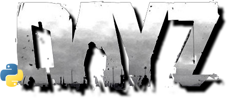
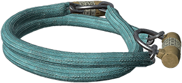
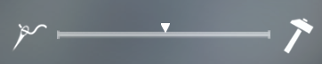

# pydayz - A DayZ tools collection



<https://www.bohemia.net/games/dayz/>

In this repository are collected tools and scripts for the game DayZ.

## Installing

### Windows

```powershell
git clone --recurse-submodules git@github.com:tassoneroberto/py-dayz.git
cd pydayz
py -3.10 -m venv venv
.\venv\Scripts\Activate.ps1
py -m pip install iocontroller
py -m pip install .
```

## Passcode cracking

Bruteforce the 3 and 4 discs combination locks (vanilla only).



### Usage

It is recommended to set the game in window mode.

Make sure the current moving disc is the last one (units digit).

Note: Press `ESC` to interrupt the bot.

```powershell
pydayz_crack_passcode --discs 3
```

Get the arguments list with the `help` function:

```powershell
pydayz_crack_passcode --help
```

### Command line arguments

The following table is listing all the arguments you can use:

| arg           |  description      | Default |
|:-------------:|:-----------------:|:-------:|
| help          | Arguments description | `N/A` |
| discs*        | Number of discs on the padlock [3, 4] | `None` |
| initial       | Initial combination | `0000` |
| speed**       | Rotation speed (ms) | `550` |
| timeout       | Maximum time allowed (seconds) | `∞` |

**Required*

***Depends on the soft skills bar*


